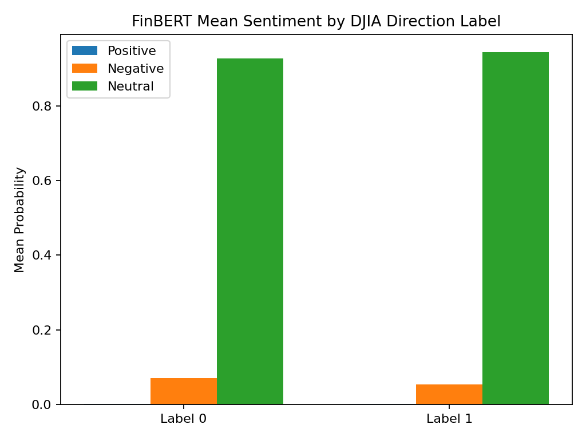
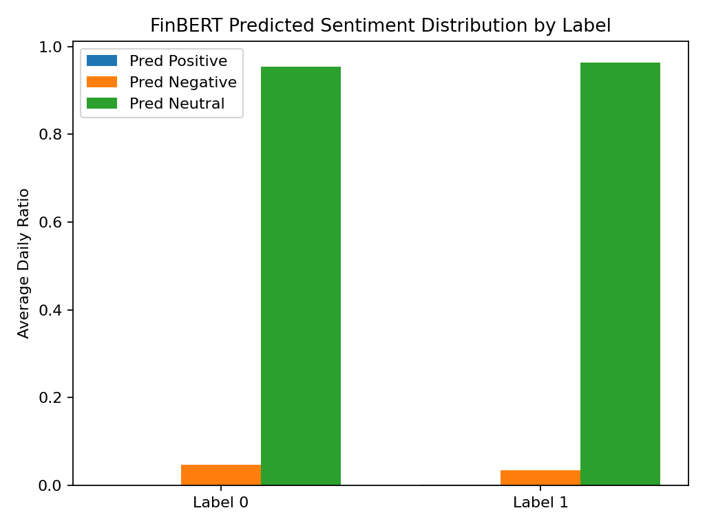
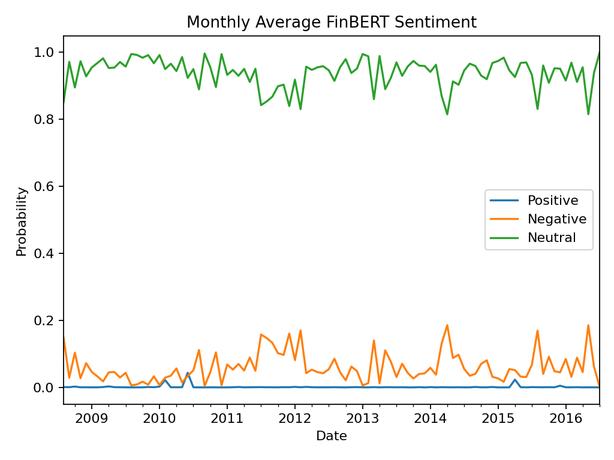

# Financial News Sentiment Analysis for DJIA Direction Prediction

Built a financial NLP pipeline for DJIA direction prediction using TF-IDF, VADER, FinBERT, and reproducible data analysis workflows.

---

## Problem Statement

Financial markets are highly sensitive to news sentiment,
yet raw textual information is difficult to quantify directly.

This project explores whether NLP-based sentiment signals
derived from financial headlines can provide meaningful
information regarding DJIA market direction.

The project focuses on:

- sentiment engineering from financial news
- exploratory text analysis
- transformer-based financial sentiment inference
- reproducible data processing pipelines

---

# Exploratory Data Analysis (EDA)

## 1. Label Distribution

DJIA 상승(1)과 하락(0) 데이터의 분포를 시각화하였다.

---

## 2. Monthly Up Ratio Trend

월별 상승 비율 변화를 시계열 기반으로 분석하였다.

---

## 3. Monthly VADER Sentiment Trend

VADER 기반 감성 점수의 월별 평균 추이를 시각화하였다.

---

## 4. Repeated Word Ratio Distribution

뉴스 내 반복 단어 비율 분포를 Label별로 비교하였다.

---

## 5. Daily News Length Distribution

일별 뉴스 단어 수 분포를 히스토그램으로 분석하였다.

---

## 6. Top Word Frequency

뉴스 데이터 내 상위 빈출 단어를 시각화하였다.

---

## 7. Average VADER Sentiment by Label

상승/하락 Label별 평균 감성 점수를 비교하였다.

---

# FinBERT Sentiment Analysis

## 1. FinBERT Mean Sentiment by Label

FinBERT 기반 평균 감성 확률을 상승/하락 Label 기준으로 비교하였다.

---

## 2. FinBERT Predicted Sentiment Distribution

FinBERT가 예측한 Positive / Negative / Neutral 비율을 Label 기준으로 비교하였다.

---

## 3. Monthly FinBERT Sentiment Trend

FinBERT 감성 점수의 월별 평균 변화를 시계열로 분석하였다.

---

# Generated Outputs

| File | Description |
|---|---|
| processed_news.csv | 전처리 완료 데이터 |
| vader_sentiment_scores.csv | VADER 감성 점수 결과 |
| repeated_word_ratio.csv | 반복 단어 비율 |
| headline_finbert_scores.csv | Headline-level FinBERT 결과 |
| daily_finbert_aggregates.csv | 일별 FinBERT 집계 결과 |
| baseline_classification_report.csv | 기본 분류 성능 평가 |
| baseline_confusion_matrix.csv | Confusion Matrix 결과 |

---

# Engineering Insights

## NLP-Based Financial Signal Engineering

단순 뉴스 텍스트 수집이 아니라,
텍스트 기반 금융 시계열 신호를 생성하기 위한 Feature Engineering을 수행하였다.

주요 특징:
- VADER 감성 분석
- 반복 단어 비율 분석
- 뉴스 길이 기반 통계 분석
- Label 기반 분포 비교
- FinBERT 기반 금융 특화 감성 추론

등을 통해 시장 방향성과의 관계를 탐색하였다.

---

## FinBERT-Based Insight

FinBERT 예측 결과 대부분의 뉴스가 Neutral sentiment에 강하게 집중되는 경향을 보였다.

이는 다음과 같은 가능성을 시사한다:

- 금융 뉴스 헤드라인은 실제로 중립적 표현을 많이 사용함
- 시장 방향성은 단순 headline sentiment만으로 설명되기 어려움
- 추가적인 거시경제 변수 및 시계열 정보가 필요할 수 있음

즉, 감성 분석만으로 금융 시장 방향성을 완전히 설명하기 어렵다는 점을 확인하였다.

---

## Data Pipeline Structuring

EDA → Feature Engineering → Sentiment Analysis → Visualization → Classification 흐름으로
데이터 분석 파이프라인을 구조화하였다.

또한:
- outputs/
- figures/
- tables/
- src/

디렉토리 분리를 통해 재현 가능한 분석 구조를 구성하였다.

---

## Reproducibility & Portfolio Engineering

단순 코드 업로드가 아니라:
- 데이터 처리 결과 저장
- 시각화 자동 생성
- README 기반 결과 문서화
- GitHub 기반 포트폴리오 구조화
- 분석 결과 재현 가능성 확보

까지 포함하여 재현 가능한 분석 프로젝트 형태로 구성하였다.

---

# Limitations

본 프로젝트에서는 다음과 같은 한계점도 확인하였다.

- sentiment signal만으로는 시장 상승/하락을 명확히 분리하기 어려움
- FinBERT 예측 결과가 Neutral sentiment에 과도하게 집중됨
- 시계열 예측 모델(LSTM, Transformer Forecasting 등)을 적용하지 않음
- 거시경제 변수 및 기술적 지표를 포함하지 않음

따라서 본 프로젝트는
실거래용 예측 모델이라기보다,

NLP 기반 금융 데이터 분석 및 감성 추론 파이프라인 구축에 초점을 둔
Exploratory Project로 해석하는 것이 적절하다.

---

# Future Work

향후 확장 가능성:

- 기술적 지표(Technical Indicators) 통합
- LSTM / Transformer 기반 시계열 모델 적용
- Rolling Window Backtesting 적용
- 이벤트 단위 금융 메타데이터 활용
- 최신 금융 특화 LLM과의 비교 실험

등을 통해 보다 고도화된 금융 NLP 분석으로 확장 가능하다.

---

# GitHub Repository

https://github.com/SinungKim/financial-news-djia-prediction
