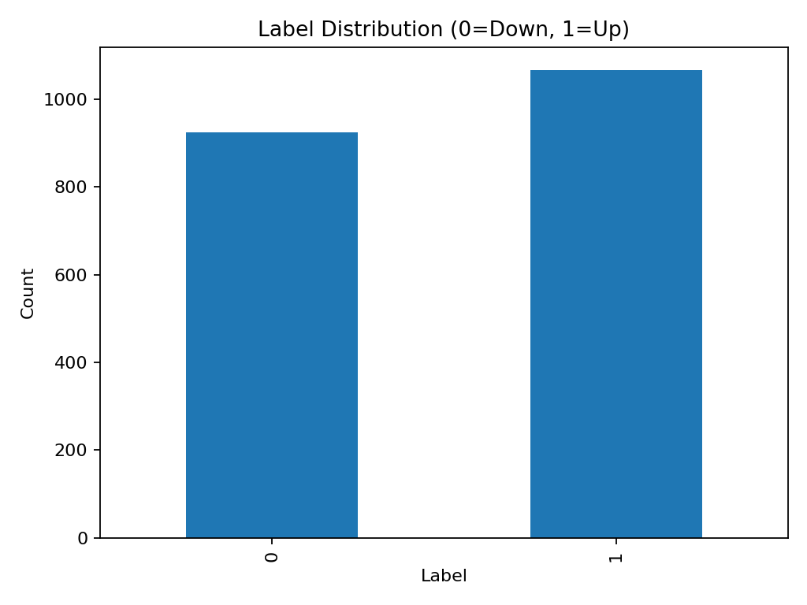
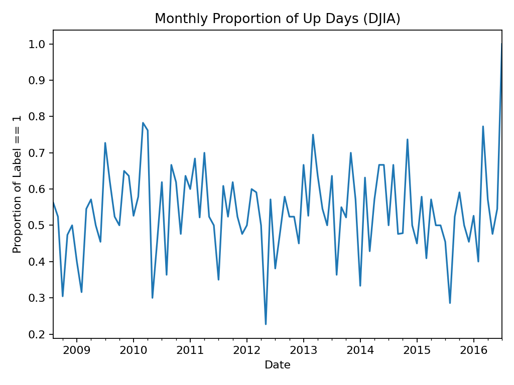
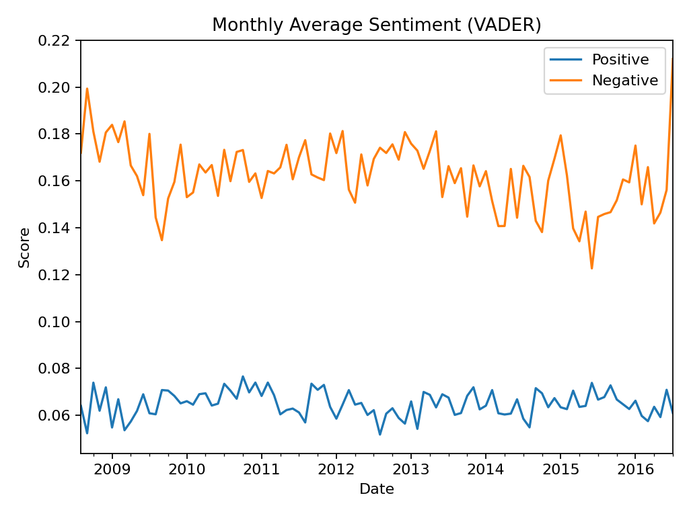
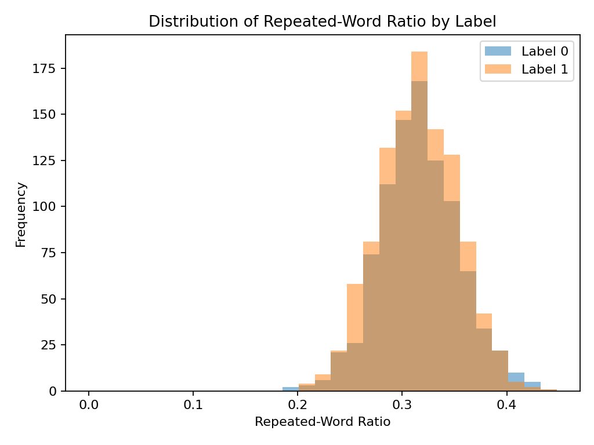
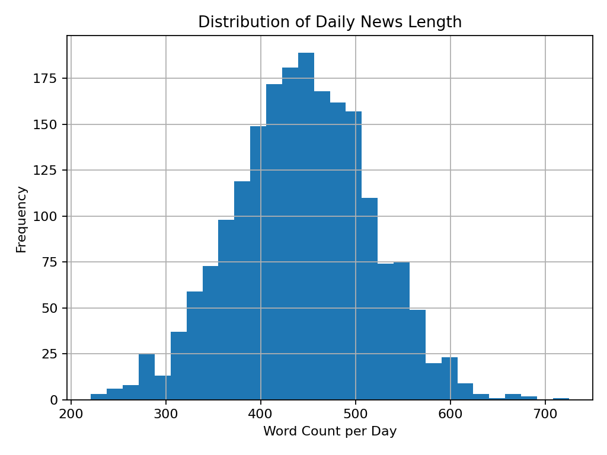
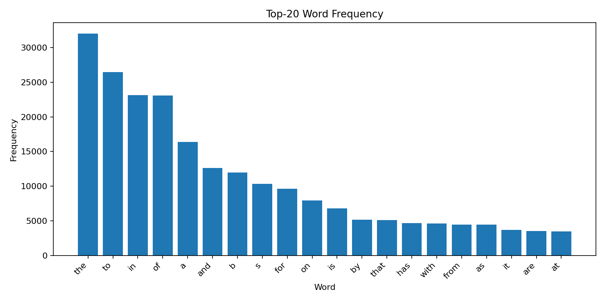
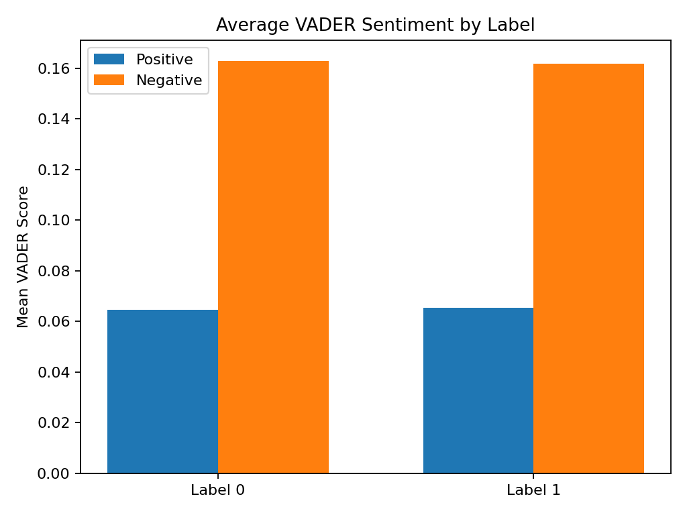

# financial-news-djia-prediction
Financial news sentiment analysis and DJIA direction prediction using Python, TF-IDF, VADER, and FinBERT

---

# Exploratory Data Analysis (EDA)

## 1. Label Distribution

DJIA 상승(1)과 하락(0) 데이터의 분포를 시각화하였다.

---

## 2. Monthly Up Ratio Trend

월별 상승 비율 변화를 시계열 기반으로 분석하였다.

---

## 3. Monthly VADER Sentiment Trend

VADER 기반 감성 점수의 월별 평균 추이를 시각화하였다.

---

## 4. Repeated Word Ratio Distribution

뉴스 내 반복 단어 비율 분포를 Label별로 비교하였다.

---

## 5. Daily News Length Distribution

일별 뉴스 단어 수 분포를 히스토그램으로 분석하였다.

---

## 6. Top Word Frequency

뉴스 데이터 내 상위 빈출 단어를 시각화하였다.

---

## 7. Average VADER Sentiment by Label

상승/하락 Label별 평균 감성 점수를 비교하였다.

---

# Generated Outputs

| File | Description |
|---|---|
| processed_news.csv | 전처리 완료 데이터 |
| vader_sentiment_scores.csv | 감성 점수 결과 |
| repeated_word_ratio.csv | 반복 단어 비율 |
| baseline_classification_report.csv | 기본 분류 성능 평가 |
| baseline_confusion_matrix.csv | Confusion Matrix 결과 |

---

# Engineering Insights

## NLP-Based Financial Signal Engineering

단순 뉴스 텍스트 수집이 아니라,
텍스트 기반 금융 시계열 신호를 생성하기 위한 Feature Engineering을 수행하였다.

주요 특징:
- VADER 감성 분석
- 반복 단어 비율 분석
- 뉴스 길이 기반 통계 분석
- Label 기반 분포 비교

등을 통해 시장 방향성과의 관계를 탐색하였다.

---

## Data Pipeline Structuring

EDA → Feature Engineering → Visualization → Classification 흐름으로
데이터 분석 파이프라인을 구조화하였다.

또한:
- outputs/
- figures/
- tables/

디렉토리 분리를 통해 재현 가능한 분석 구조를 구성하였다.

---

## Reproducibility & Portfolio Engineering

단순 코드 업로드가 아니라:
- 데이터 처리 결과 저장
- 시각화 자동 생성
- README 기반 결과 문서화
- GitHub 기반 포트폴리오 구조화

까지 포함하여 재현 가능한 분석 프로젝트 형태로 구성하였다.
